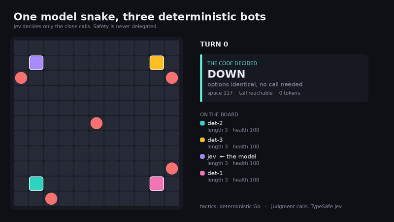
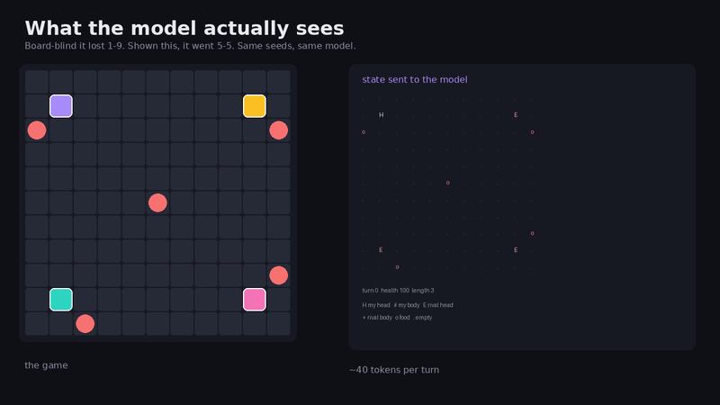

# battlesnake-jev

A [Battlesnake](https://docs.battlesnake.com) written in Go, where the tactics
are deterministic code and the judgment calls go to
[TypeSafe's Jev](https://docs.typesafe.ai) — a System One model that returns
typed answers and probabilities instead of text.

The interesting part is not that a model plays a game. It is that the question
*"did the model actually help?"* was answered with controls instead of vibes,
and the answer was mostly no. [BENCHMARK.md](BENCHMARK.md) has the workings.



Purple is the snake that can consult the model. The other three are the same
binary with the API key unset. The panel names which of the two decided each
move and why — most turns the code decides alone and spends nothing.

## Three results worth the read

**Showing the model the board is the whole ballgame.** Given only the numbers
the scorer had already computed, it lost 1-9 against the plain bot. Given about
forty extra tokens of the board drawn as text, the same model on the same seeds
went 5-5.



**Over 200 games, consulting the model changed nothing measurable.** 101-89-10,
against 29-23-8 for two identical bots. A difference of -2.6 points, z = -0.34.

**But it is nowhere near random.** Handing the same decisions to a coin loses
2-18. Committing to *a* direction is most of what breaking a tie is for, and the
scorer's arbitrary-but-consistent preference already captured nearly all of it.

## What it does, and what it does not

Stated plainly, because several of these would otherwise be a surprise.

**What it does.** Every turn it finds the moves that are collision-safe, then
scores each one on: reachable space by flood fill, whether its own tail is still
reachable from there, the head-to-head outcome against every rival that could
enter the same square and how many of them could, whether the square is a
hazard, and how far the nearest food is. It never returns an unsafe move and
never returns late. Optionally it asks the model to break genuinely close calls
and, in the background, to pick a posture.

**It does not search.** This is the big one. The snake reasons about the square
it is about to enter, one move ahead — that is the whole horizon. A trap being
set two or three moves out is invisible to it. Strong competitive snakes run
multi-ply search; this does not, and no amount of model judgment substitutes for
that.

**It does not model opponents.** It assumes a rival may enter any square next to
its head, and weighs that. It does not predict which square a rival will choose,
or notice that one is deliberately cutting it off. Asking the model to spot that
was tried and measured: the signal was not usable (-0.085 correlation).

**It does not learn.** The scoring weights are hand-tuned constants. Nothing
adapts during a game or between games.

**Only the standard ruleset is implemented.** `ruleset.name` and `map` are
logged and never branched on, so royale, constrictor, wrapped and squad games
are played with standard logic. Wrapped boards in particular would be played
*wrong*: leaving the board is always treated as fatal, so it would refuse the
wrap-around moves that ruleset depends on.

**Hazards are a flat penalty, not a health calculation.** A hazard square costs
a fixed deduction. `hazardDamagePerTurn` is never read, so a mild hazard and a
lethal one are scored identically. `foodSpawnChance` and `minimumFood` are
likewise ignored.

**Food is distance-only.** It knows how far food is, not whether a rival gets
there first.

**The model does not make it stronger.** Over 200 games the difference was not
detectable. It is there because the question was worth answering, and the answer
is written down rather than assumed.

## The constraint that shaped everything

A Battlesnake has **500ms per turn, and that budget includes the round trip**
from the game engine. Miss it and the engine moves you `up` on turn one, or
repeats your last move after that — usually fatal.

Measured against the live API from Europe:

| Condition | Latency |
| --- | --- |
| Cold connect, TLS handshake | 640–735 ms |
| Warm, connection reused | 253 / 300 / 328 ms (min / p50 / p90) |

A cold connect costs more than an entire turn. So the connection pool is kept
warm and warmed again at startup, the deterministic move is computed **first and
held**, and inference is only consulted when there is budget for it. Across
~2,000 logged turns at the default 500ms budget, **zero turns went over**, and
every deadline miss fell back to the move already in hand.

Payload size barely moves latency, so keeping the token count down is a cost and
answer-quality lever rather than a speed one.

## How a move gets decided

```
/move
 ├─ 1. flood fill, tail reachability, head-to-head       (~0.1ms)
 ├─ 2. apply the cached strategy from the model          (0ms)
 ├─ 3. no safe move        -> least bad, no call
 │     one safe move       -> play it, no call
 │     one clearly best    -> play it, no call
 │     options identical   -> play the first, no call
 │     otherwise, and if the budget covers it:
 │        ask the model, with a hard deadline
 │        └─ miss, error, or an answer outside the safe set
 │           -> the deterministic move, already in hand
 └─ 4. respond, shouting who decided and why

(background, off the critical path)
     posture: survive / eat / hunt / trap
```

Safety is never delegated. An answer naming a move outside the proven-safe set
is discarded, not played.

### What the model is shown

Not the raw request. Identifiers, customisations, shouts and latencies are
dropped in favour of a digest, plus the board drawn as text:

```
...........
.....2.....
.111Bo D333
.....A.....      H my head, # my body, E rival head,
.....0.....      + rival body, o food, x hazard
```

That board costs about forty tokens and it is the single most valuable thing in
the request — see the benchmark.

## The numbers

Duels against the **same binary** with `TYPESAFE_API_KEY` unset, so the only
difference is whether the model is consulted at all. Reproduce any row with
`make tournament`.

| Who breaks the close calls | Games | Result | Share of decisive |
| --- | --- | --- | --- |
| The model | 200 | 101-89-10 | 53.2% |
| Two identical bots — the floor | 60 | 29-23-8 | 55.8% |
| A coin | 20 | 2-18-0 | 10% |

Consulting the model for close calls neither helps nor hurts by any amount two
hundred games can detect: **-2.6 percentage points against the floor, z = -0.34**.
It is also nowhere near random — a coin on the same decisions loses 2-18.

Committing to *a* direction turns out to be most of what breaking a tie is for.
A snake that chooses randomly between two equally-scored moves wanders, and
wandering fills in its own escape routes. The scorer's arbitrary-but-consistent
preference already captures nearly all of that value, which leaves the model
very little room above it.

Across those 200 games the model was called 5,111 times and **missed the turn
deadline once**, covered by the deterministic move already in hand. Cost: $0.12.

Showing the model the board is what separates it from being actively harmful.
Ten games per arm, so read the direction rather than the margin:

| Model sees | Wins | Losses |
| --- | --- | --- |
| The scorer's numbers only | 1 | 9 |
| The scorer's numbers and the board | 5 | 5 |

Things that did **not** work are still here behind flags, along with the
correlations that killed them: advisory noul questions about being sealed in
(-0.278 against measured space) and being hunted (-0.085, noise), and asking
which move becomes a trap later, which made play worse. See
[BENCHMARK.md](BENCHMARK.md).

## Running it

```bash
make tools          # golangci-lint, gofumpt, the Battlesnake rules CLI
make check          # the gate: fmt, vet, lint, test -race, build
make hooks          # install .git/hooks/pre-push -> make check
make run            # serve on :8080

# one local game you can watch in the browser
battlesnake play -W 11 -H 11 -t 2000 \
  --name jev --url http://localhost:8080 \
  --name det --url http://localhost:8081 --browser

make tournament GAMES=20 MODE=duel LABEL=whatever

# render a recorded game as video: the board, plus who decided each move
battlesnake play ... -o game.jsonl          # record the game
LOG_LEVEL=debug make run                    # with the decision log
make replay REC=game.jsonl LOG=server.log OUT=replay VIEW=hero
```

`TYPESAFE_API_KEY` enables inference. Without it the snake plays entirely
deterministically, which is a supported mode and the baseline every benchmark
is measured against.

| Variable | Default | Effect |
| --- | --- | --- |
| `JEV_BOARD_STATE` | on | Draw the board into the state |
| `JEV_TIEBREAK` | on | Consult the model on close calls |
| `JEV_ALWAYS_ASK` | off | Ask on every real choice; for measurement |
| `JEV_ADVISORS` | off | Also ask how confined the position is |
| `JEV_AVOID` | off | Also ask which safe move becomes a trap |
| `JEV_RANDOM_TIEBREAK` | off | Control arm: break ties with a coin |
| `JEV_MARGIN_MS` | 120 | Slack held back from the turn budget |

## Layout

Per the [official Go guidance](https://go.dev/doc/modules/layout) for a server:

```
cmd/battlesnake/     server wiring, configuration, shutdown
internal/api/        wire types and snake customisation
internal/game/       pure board logic, no I/O
internal/strategy/   the decision ladder and per-game state
internal/jev/        TypeSafe client (there is no Go SDK)
internal/server/     the four webhooks
```

`internal/game` is pure functions over a board, which is why it is the
best-tested package here.
